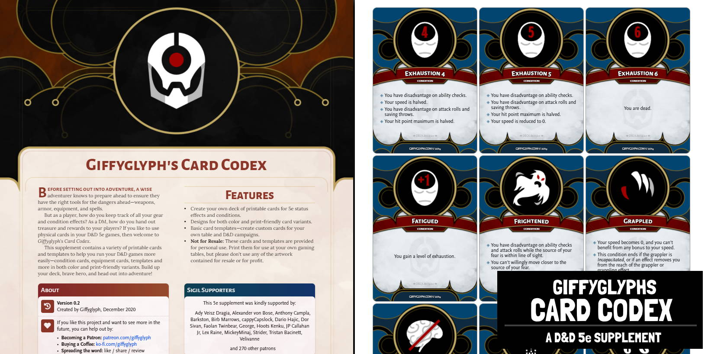
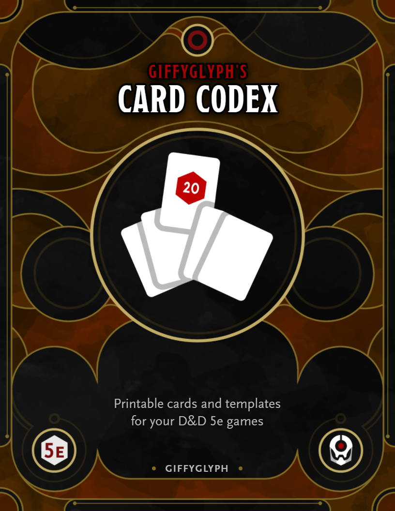
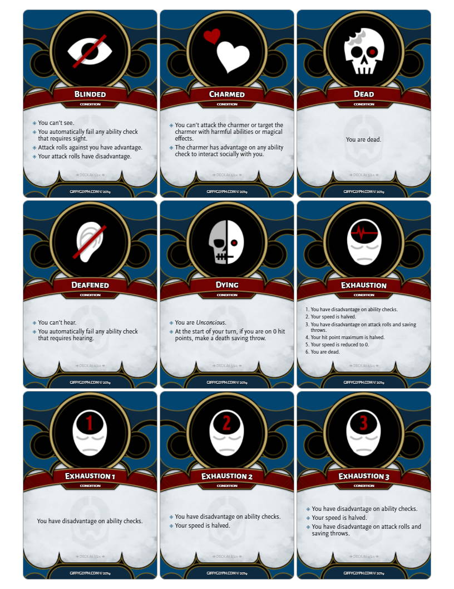

# Giffyglyph's Card Codex

Do you want printable cards for your D&D 5e game? Then try **Giffyglyph's Card Codex**, a collection of printable cards suitable for any D&D game!

* [Read the Latest PDF (v0.2.0)](https://github.com/giffyglyph/giffyglyphs-card-codex/releases/download/v0.2.0/giffyglyphs_card_codex_v0_2_0.pdf)
* [Read the Changelog](https://github.com/giffyglyph/giffyglyphs-monster-maker/blob/master/docs/CHANGELOG.md) 

## Features

* Create your own deck of printable cards for 5e status effects and conditions.
* Designs for both color and print-friendly card variants.
* Basic card templates—create custom cards for your own table and D&D campaigns.

| Cover                                               | Cards                                               |
| --------------------------------------------------- | --------------------------------------------------- |
|  |  |

## Roadmap

To see what's being worked on right now—and what may be planned for the future—check out the **[projects board](https://github.com/giffyglyph/giffyglyphs-card-codex/projects)**.

## Bugs and Feature Suggestions

If you notice a bug or have a feature suggestion, visit the **[issue board](https://github.com/giffyglyph/giffyglyphs-card-codex/issues)** and open a ticket. Please make sure to be as thorough as possible in your report and attach screenshots where appropriate, as low-effort tickets may be closed out-of-hand.

## Support

If you'd like to see more from this project in future, please consider [becoming a patron](https://www.patreon.com/giffyglyph). You can also find more of my work at:

* [giffyglyph.com](https://giffyglyph.com)
* [twitter](https://twitter.com/giffyglyph)
* [twitch.tv/giffyglyph](https://twitch.tv/giffyglyph)

## Licensing

This work is licensed under a [Creative Commons Attribution-NonCommercial-NoDerivatives 4.0 International License](http://creativecommons.org/licenses/by-nc-nd/4.0/).
